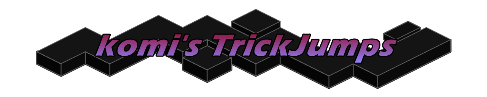

# komi's Trickjumps
This plugin is mean't to make trickjumping more popular by creating commands that make sharing jumps easier.

### Feature List
| Name            | Description                                                                                 | Status |
| --------------- | ------------------------------------------------------------------------------------------- | :----: |
| Jump Management | Ability to manage jumps. Saving, Deleting, and Setting.                                     |   🟢    |
| Jump List       | A menu that shows all saved jumps.                                                          |   🟢    |
| Jump Sharing    | By typing a command, receive an encoded string which you can load to create a jump locally. |   🔵    |

#### !!! NEED SUGGESTIONS, PLEASE GIVE ME JUICY SUGGESTIONS !!!

#### Legend
🟢 Finished\
🟡 In-Progress\
🔴 Haulted\
🔵 Need-Help\
⚪ Not-Started

### Commands
`/createjump <name>` - Creates a jump.\
`/deletejump <name>` - Deletes a jump.\
`/setjump <name>` - Sets jump, teleport player to location. Don't pass <name> for jump list.\
`/jumps` - Opens the jumps list.

more on the way...